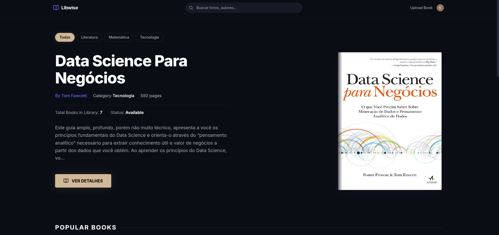

# 📚 Libwise - Virtual Library



**Libwise** is a Full-Stack virtual library application designed to archive and organize PDF documents. The architecture is engineered to scale in the cloud, eliminating critical infrastructure limitations (like Vercel's payload restrictions) while adopting basic CI/CD and automated testing.

## 🚀 Features

- **Professional Authentication**: Secure user management integrated with Server Actions via [Clerk](https://clerk.com/).
- **Direct & Decentralized Uploads (Presigned URLs)**: Heavy PDF files are uploaded strictly from the Client-side browser directly to **Cloudflare R2**, bypassing the 4.5MB Vercel limit.
- **Fast Automatic Cover Generation**: Utilizes native Web APIs (`Canvas`) and `ArrayBuffer` manipulation on the Frontend (`pdf.js`) to extract and generate JPG images of the first page during runtime, preventing binary processing on the server.
- **Debounced Global Search**: Optimized search system designed to avoid sending simultaneous queries to the Database.
- **Route-Level Security (Rate Limiting)**: In-memory locks within Server Actions to prevent DDoS attacks or abusive spamming of uploads/searches from the same IP/User.

## ⚙️ DevOps & Code Quality

- **Continuous Integration (CI/CD)**: Pipeline configured via **GitHub Actions** to integrate and type-check the build on every *Push*. The CI simulates credentials in an isolated environment.
- **Automated Git Hooks (Husky)**: Active local trigger (`pre-push`) that locks the pipeline and forces TypeScript, Linter, and Unit Tests to pass before allowing updates to the main branch.

## 🛠️ Tech Stack

- **Frontend**: Next.js 14+ (App Router), React, Tailwind CSS, TypeScript.
- **Backend / API**: NodeJS Server Actions.
- **Database**: PostgreSQL by Supabase, accessed through the **Prisma** ORM.
- **Object Storage**: Low-cost S3-Compatible Storage ([Cloudflare R2](https://www.cloudflare.com/developer-platform/r2/)), accessed using the Global AWS SDK (`@aws-sdk/s3-request-presigner`).
- **Binary Engines**: `pdf.js` & `pdf-lib` for mathematical reading of PDF buffers.

## 🖱️ Local Installation

1. Clone the repository:
```bash
git clone https://github.com/kaiowsz/libwise_.git
```

2. Install all dependencies:
```bash
npm install
```

3. Set up the `.env` file (create keys in respective services based on `.env.example`):
```env
DATABASE_URL=
DIRECT_URL=
NEXT_PUBLIC_CLERK_PUBLISHABLE_KEY=
CLERK_SECRET_KEY=
R2_ACCESS_KEY_ID=
R2_SECRET_ACCESS_KEY=
R2_ACCOUNT_ID=
R2_BUCKET_NAME=
R2_PUBLIC_DEV_URL=
NEXT_PUBLIC_R2_DEV_URL=
```

4. Push the Database Schema:
```bash
npx prisma db push
# The "prisma generate" postinstall script will run automatically during npm install.
```

5. Start the Development Server:
```bash
npm run dev
```

Access the app at `http://localhost:3000`.

## 🧪 Testing Suites

This application uses Vitest & Playwright to prevent code vulnerabilities:
```bash
# Run Route & Critical Isolation Tests (Vitest)
npm run test

# Run Visual & Logic Flow Tests (Playwright)
npm run test:e2e
```
